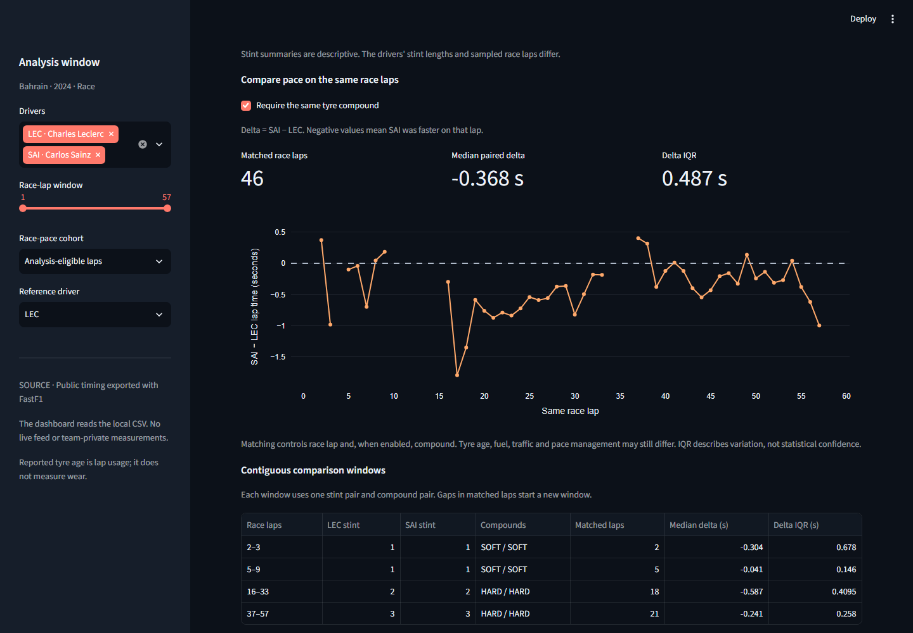
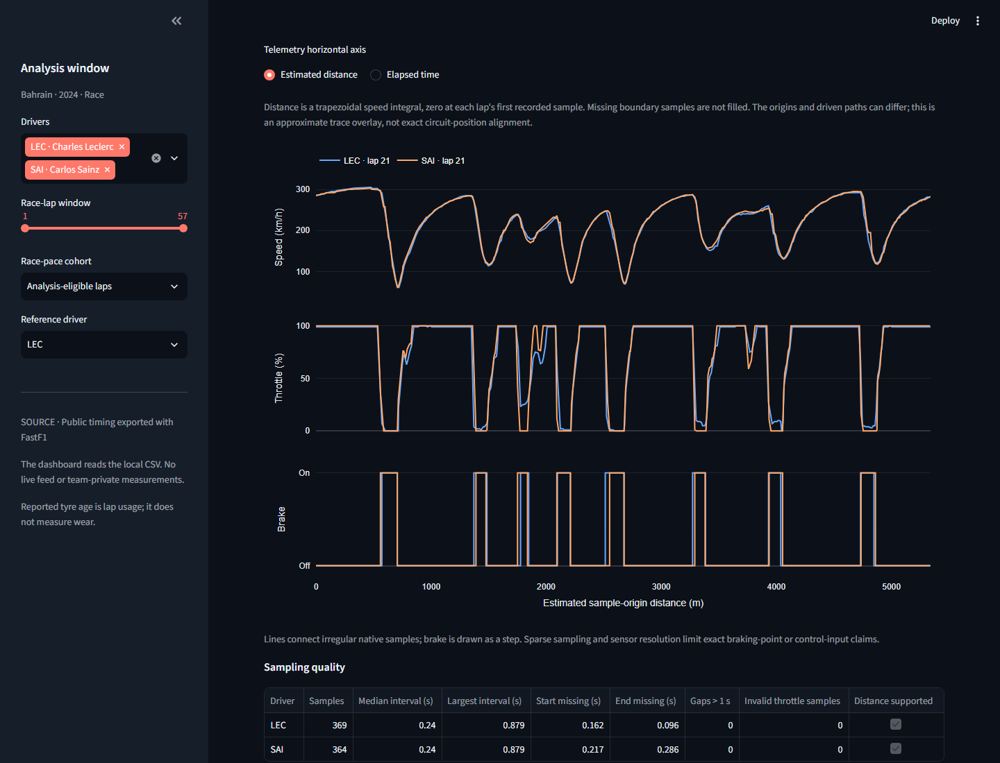

# PitWall: engineering overview

PitWall asks three practical questions: how does observed race pace compare on shared race laps; which telemetry comparisons survive sampling checks; and can a small next-lap model beat recent-lap baselines on later weekends?

The working Python/Streamlit lab uses public archived FastF1 data. Its strongest evidence is a reproducible comparison with explicit selection rules and retained failures: Ridge achieves 0.280751 s mean absolute error (MAE) across 596 held-out targets, but loses to last-lap persistence in Miami. This independent portfolio has no affiliation with an F1 team. Driver/team references reflect the 2024 data.

## Race pace: make the comparison denominator visible

The Bahrain Ferrari study retains all 114 LEC/SAI lap records. Its audit marks 101 eligible and 13 excluded, rather than deleting rejected rows. Opening, pit-in/out, non-green, inaccurate, deleted/generated or unknown-flag records and invalid timing/lap numbers fail eligibility. Exclusion reasons can overlap.

Matching eligible observations by race-lap number and reported compound yields 46 pairs. Median SAI minus LEC lap time is -0.368 s. This is a median of paired differences; relaxing compound matching gives 47 pairs. Contiguous comparison windows break when matched laps are missing or either driver's stint/compound changes.

*Forty-six same-compound pairs make the selected denominator explicit; negative deltas indicate lower recorded SAI times.*

Matching controls race lap and compound, but tyre age, traffic, fuel load and pace management can still differ. This describes the selected race observations; it does not identify driver skill or causal tyre degradation. Reported tyre usage measures laps used, not physical wear.

## Telemetry: preserve observations and disclose estimates

The export retains 41,286 native car samples across the same 114 laps, without interpolated edges or merged position data. Public speed, throttle and brake on/off are distinct from derived distance and aligned differences; brake pressure is unavailable.

Timing eligibility and telemetry suitability are separate. Only 64 of 101 timing-eligible laps meet the declared distance-support checks. Across all 114 laps, 39 contain a sampling gap over 1.0 s. Failed coverage remains visible.

*Lap 21 has 369 LEC and 364 SAI samples. Both use HARD tyres, with reported ages of 10 and 7 laps.*

Distance is a trapezoidal speed integral, starting at each lap's first recorded sample. Missing boundary time is disclosed without extrapolation. Invalid speed or a gap over the threshold withholds later absolute distance estimates. Optional alignment interpolates only over common support on a 10 m grid; elapsed-time traces preserve gap breaks.

The lap-21 timing difference is -0.873 s, independently of that alignment. Sparse, irregular samples and different sample origins/driven paths prevent exact circuit-position, braking-point or corner time-gain claims.

## ML: forecast the actual next lap with honest baselines

At completed lap t, Ridge estimates the time of actual lap t+1 by predicting a correction to the last observed time. Inputs are completed lap number, reported tyre age, last lap time, trailing median minus last time, driver and compound. Telemetry is not an ML feature.

Pairs are truly consecutive within one driver, event, known stint and compound. Both laps must pass the final audit. History uses at most three consecutive eligible observations and resets at gaps, exclusions and stint/compound/event boundaries. Future eligibility is established retrospectively for scoring; this conditional forecast does not predict pit stops, incidents or whether the next lap will qualify.

The fixed whole-weekend split uses 708 training targets from Bahrain/Australia/Japan, 232 China validation targets and 596 Miami/Imola test targets. Scaling, category encoding and Ridge fit training only. China selects alpha 10 from the declared four-value grid; the fit stays frozen. Prior observed held-out laps update subsequent one-step histories without refitting.

*Six selected weekends and six recurring drivers: LEC/SAI, HAM/RUS and VER/PER, representing Ferrari, Mercedes and Red Bull in 2024.*

Every method scores the same targets. Persistence repeats the last lap; the other baseline uses the available trailing median.

| Test scope | Targets | Ridge MAE (s) | Persistence MAE (s) | Median MAE (s) |
|---|---:|---:|---:|---:|
| Miami | 262 | 0.281009 | 0.280095 | 0.283742 |
| Imola | 334 | 0.280548 | 0.294527 | 0.290335 |
| Pooled | 596 | 0.280751 | 0.288183 | 0.287437 |

The pooled gain over persistence is 7.432 ms. Giving each weekend equal weight yields 0.280779 s for Ridge versus 0.287311 s for persistence. Ridge also loses to persistence for HAM/VER and to the median for PER in pooled driver results.

Adjacent errors are correlated; 596 rows are not independent trials. No statistical significance or calibrated uncertainty is claimed. Numeric inputs outside training ranges remain reported, not removed. Both studies lack held-out SOFT targets; two later circuits with recurring drivers do not establish season-wide or unseen-driver performance. Archived flags/timing do not reproduce live latency or revisions.

## Reviewer walkthrough

Follow the [README setup](README.md#run-locally), then inspect Bahrain **Tyre stints** with both drivers and compound matching; **Telemetry** at shared lap 21 and gap-containing lap 20; and **Across weekends** with both test events, followed by Miami alone. Download matched pairs, audits and predictions to examine denominators and failures.

The [Bahrain case study](CASE_STUDY.md), [pilot model card](MODEL_CARD.md), [weekend model card](WEEKEND_MODEL_CARD.md), [fixed protocol](WEEKEND_PROTOCOL.md) and [lap audit](reports/weekends/lap_audit.csv) provide detail. [Validation](VALIDATION.md) records 86 passing tests, fresh Windows installation and desktop/mobile browser checks. Source/artifact hashes preserve provenance.

Observed public timings/channels and reported metadata remain distinct from model/distance estimates. Private fuel, setup, tyre measurements and brake pressure are absent. The engineering tradeoff is a compact, inspectable historical lab with repeatable baseline comparisons; live operation and computer vision remain future work.