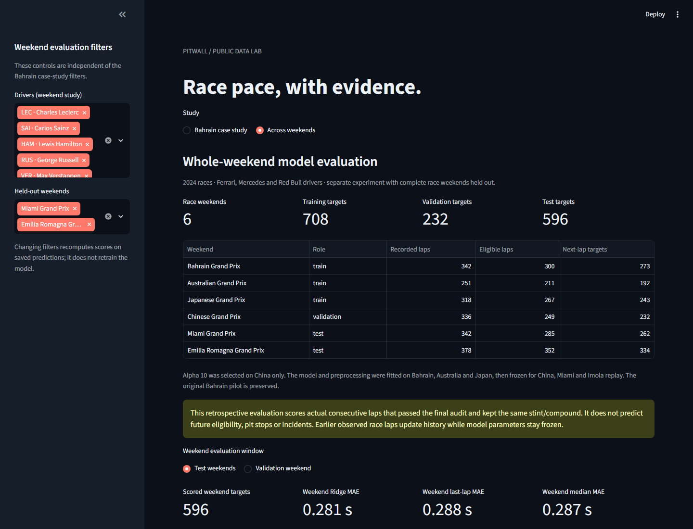

# PitWall — F1 Telemetry & Race Pace Lab

An independent motorsport data-science portfolio exploring two questions:
how do drivers' observed race laps compare under explicit selection rules,
and can a next-lap model beat recent-lap baselines on later race weekends?

PitWall combines audited public timing, native telemetry inspection and two
separate historical forecasting studies. The dashboard exposes exclusions,
sampling limitations and baseline wins alongside the results. It runs locally
without an API key or paid service.

**Repository:** [m11ahmed/PitWall](https://github.com/m11ahmed/PitWall)

**Start here:** [Engineering overview](ENGINEERING_OVERVIEW.md) ·
[Bahrain case study](CASE_STUDY.md) ·
[Whole-weekend model card](WEEKEND_MODEL_CARD.md) ·
[Validation evidence](VALIDATION.md)



*The Across weekends view keeps event roles, coverage and held-out scores visible.
Driver/team associations refer to the selected 2024 races.*

## What you can inspect

| Study | Evidence | Dashboard view |
|---|---|---|
| Bahrain 2024, LEC/SAI | 114 recorded laps; 101 eligible; 46 same-compound matched pairs | Race pace, Tyre stints, Lap audit |
| Bahrain native telemetry | 41,286 public car samples; 64 of 101 eligible laps support conservative distance alignment | Telemetry |
| Conditional next-lap ML | Original Bahrain pilot plus a separate six-driver, six-weekend evaluation | ML pace, Across weekends |

Downloads retain lap/event identity, selection reasons and predictions from
all methods. Changing dashboard filters recomputes displayed scores from saved
forecasts; it never refits the model.

## Main ML result

The expanded Ridge model predicts a correction to the last observed lap time.
It uses completed-lap timing, reported tyre usage, driver and compound; telemetry
is inspected separately and does not enter either model.

Whole Bahrain/Australia/Japan weekends provide **708 training targets**.
**232 China targets** select alpha 10 from a fixed grid; preprocessing and the
training fit then remain frozen. Miami and Imola supply **596 test targets**.
All three methods score the same actual consecutive eligible laps.

| Method | Test MAE (s) | Test RMSE (s) |
|---|---:|---:|
| Ridge correction | 0.280751 | 0.401706 |
| Repeat the last lap | 0.288183 | 0.419431 |
| Median of up to 3 preceding eligible laps | 0.287437 | 0.417424 |

The pooled gain over the last-lap baseline is **0.007432 s MAE**. It is small
and inconsistent: Ridge loses in Miami and to a baseline for HAM, PER and VER.
Two later weekends with the same six drivers provide limited evidence of transfer.
No significance or general predictive superiority is claimed. See the
[per-weekend/per-driver results](WEEKEND_MODEL_CARD.md#held-out-results).

The preserved Bahrain pilot uses different targets: 22 final-test laps, with
Ridge MAE 0.143864 s versus last lap 0.155909 s; Ridge loses for LEC. These two
studies are separate evaluations, not before/after versions of one score.

## Run locally

**Verified platform:** Windows, Python 3.14.0. Clone or download the repository
onto your preferred drive. From the project directory, with Python 3.14 on PATH:

```powershell
.\scripts\setup.ps1
.\.venv\Scripts\python.exe -m streamlit run app.py
```

If python is unavailable, supply the actual path to your installed interpreter:

```powershell
.\scripts\setup.ps1 -PythonExecutable "C:\path\to\Python314\python.exe"
```

Open [localhost:8501](http://127.0.0.1:8501/). Select **Bahrain case study** for
pace/telemetry/the original pilot, or **Across weekends** for the expanded study.
The supplied exports and frozen results work without race downloads, a FastF1
cache or training. Dependency installation uses the internet. The setup script
keeps the environment and temporary installation files inside the project,
including when it is on G:.

The full pinned environment is requirements-lock.txt. Detailed commands for
acquisition, offline training and telemetry regeneration are in
[REPRODUCING.md](REPRODUCING.md). Native telemetry regeneration requires the
separately acquired FastF1 session cache.

## Evidence and limits

Public lap times and native speed/throttle/brake samples are observations;
reported tyre usage is metadata. Integrated distance, aligned differences and
model forecasts are estimates. Private fuel load, tyre wear/temperatures, brake
pressure and engineering setup are unavailable. This project has no team affiliation.

Analysis eligibility does not imply clear air. Matching race lap and compound
does not equalize tyre age, fuel or pace management. Sample-origin distance is
not exact track position, and a speed difference is not a corner time gain.

Forecast scoring conditions on final archived eligibility of both t and t+1,
within the same known stint/compound. It does not predict pit stops, incidents
or future eligibility. Feed latency and flag revisions are untested; adjacent
errors are correlated. The expanded study covers six selected drivers and two
test weekends, not a full season or unseen-driver performance.

## Verify and review

```powershell
.\.venv\Scripts\python.exe -B -m unittest discover -s tests -v
.\.venv\Scripts\python.exe -m pip check
```

The latest executed full suite passed **86 tests** in a fresh environment.
Saved-model replay, desktop/mobile rendering and CSV downloads were also
verified. [VALIDATION.md](VALIDATION.md) records the checks and their limits;
[release evidence](reports/release/verification.json) records the fresh-install run.

Data/source hashes, exclusion audits, predictions, coverage and error tables
are included under data/ and reports/. Separate fitted pipelines are in models/.
.gitattributes preserves exact bytes for provenance checks; environments,
FastF1 cache, scratch files and local secrets are excluded from Git.

## Documentation

| Read | Purpose |
|---|---|
| [Engineering overview](ENGINEERING_OVERVIEW.md) | Questions, findings, engineering tradeoffs and reviewer walkthrough |
| [Bahrain case study](CASE_STUDY.md) | Paired race pace, telemetry quality and original pilot |
| [Pilot model card](MODEL_CARD.md) / [protocol](MODEL_PROTOCOL.md) | First study's fixed evaluation and evidence |
| [Weekend model card](WEEKEND_MODEL_CARD.md) / [protocol](WEEKEND_PROTOCOL.md) | Whole-event split, subgroup failures and domain checks |
| [Reproduction guide](REPRODUCING.md) | Setup, acquisition, offline training and artifact map |
| [Project status](PROJECT_STATUS.md) | Completed milestones and future scope |

Data tooling: [FastF1](https://github.com/theOehrly/Fast-F1).
Computer vision for annotated pit-stop or drifting footage, new model experiments
and public hosting remain separately scoped future work.
